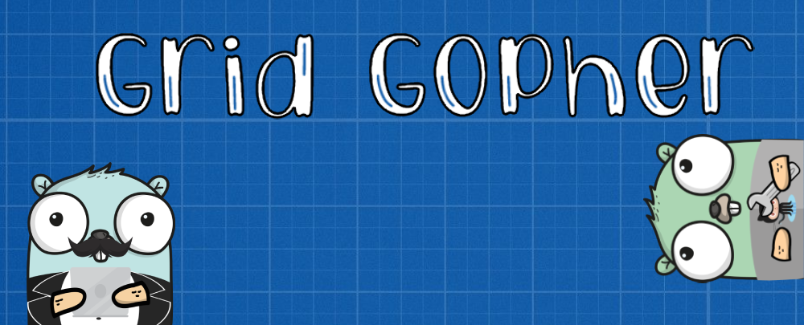

# GridGopher


[](https://codecov.io/gh/noorbuchi/GridGopher)




GridGopher is a plugin friendly tool that allows users to connect collected data
from Google Sheets and GitHub issue trackers and pull requests. The tool
provides the basic API and encourages users to utilize it in their applications.

## Set Up and Installation

**Installation using `pip` is currently not supported. However, it's planned for
future releases**

GridGopher uses Poetry to create a Python virtual environment and manage
dependencies. For more information about Poetry, check out [the
documentation](https://python-poetry.org/). To set up the tool for use, please
follow the steps outlined below:

**1- Install Poetry:**

Install poetry using the steps outlined
[here](https://python-poetry.org/docs/#installation). To verify that poetry was
installed successfully run the following:

```
poetry -V
```

The expected output is the version of Poetry installed.

**2- Install Python Dependencies:**

Once poetry has been installed successfully, clone or download the repository
and navigate to the root of the repository. Use the following command to install
all the dependencies used by GridGopher:

```
poetry install
```

This command might take some time to finish running. Once it's completed,
GridGopher is ready for use!

## Running GridGopher

### API Setup

GridGopher requires authentication tokens for a Google Sheets API service
accounts. GitHub access token are also needed if some features are used. To set
up a service account and get the tokens, please follow the steps below:

#### Google Sheets Service Account

[This tutorial](https://youtu.be/4ssigWmExak?t=215)
from `3:35` until `8:20` gives clear and
detailed steps on how to create a service account and create an authentication
key. However, it includes extra steps that not everyone will need to follow. You
can follow the video if preferred or the [Sheets API
Guide](docs/Google_API_Setup.md)

Once API credentials have been downloaded, there are 2 ways to allow GridGopher
to use them.

1. Place the downloaded JSON file in the root of the project repository
1. OR create a new `.env` file and transfer the information from the `.json`
   file to the environment file in the following format.

**Important Note:** Values in the `.env` file must be surrounded
by double quotation marks `"` otherwise, newline character `\n`
will cause issues.

Note that variable names must be in upper case.

```.evn
TYPE="service_account"
PROJECT_ID="value"
PRIVATE_KEY_ID="value"
PRIVATE_KEY="Value"
AUTH_URI="value"
TOKEN_URI="value"
AUTH_PROVIDER_X509_CERT_URL="value"
CLIENT_X509_CERT_URL="value"
```

#### Github Access Token

If you intend to use GridGopher's GitHub interactions features, it's required to
create a GitHub access token and place it correctly in the project repository.
To create a token, please use the official guide found
[here](https://docs.github.com/en/authentication/keeping-your-account-and-data-secure/creating-a-personal-access-token).
Created tokens should be granted `repo` access.

Once a token has been created, there are two ways to allow GridGopher
to use it:

1. Create a json file in the repository root with the following format (note
   that the `gh_access_token` key is required):

   ```json
   {
     "gh_access_token": "paste your token here"
   }
   ```

1. OR add a variable to the `.env` file in the following format

     ```.env
     GH_ACCESS_TOKEN="paste your token here"
     ```

### Writing Config

GridGopher relies on user written YAML configuration to collect data from Google
Sheets and organize it in regions. GitHub interactions are also managed by
YAML configuration. To read more about the structure of GridGopher
configuration, please refer to our [schema documentation](docs/schemas.md).

#### Sheets Collector

Sheets Collector the component of GridGopher responsible for making Google
Sheets API calls and retreiving data from user specified files and sheets.
Additionally, it creates an object oriented structure for regions and sheets
of data. In order to use this component, configuration YAML files are needed
in the `config/sheet_sources` directory. Multiple files can be used if multiple
sheets are being read at the same time.

#### Github Interactions

Another component of GridGopher is the GitHub Interaction interface. It's
responsible for making API requests to GitHub and posting user specified
information to GitHub in the form of Issue Trackers, Pull Requests, and files.
The user has complete control of this component's behavior through YAML
configurations files found in `config/github_interactions` directory. Multliple
files can be used if preferred.

### Using Command Line Interface

### Plugin System
