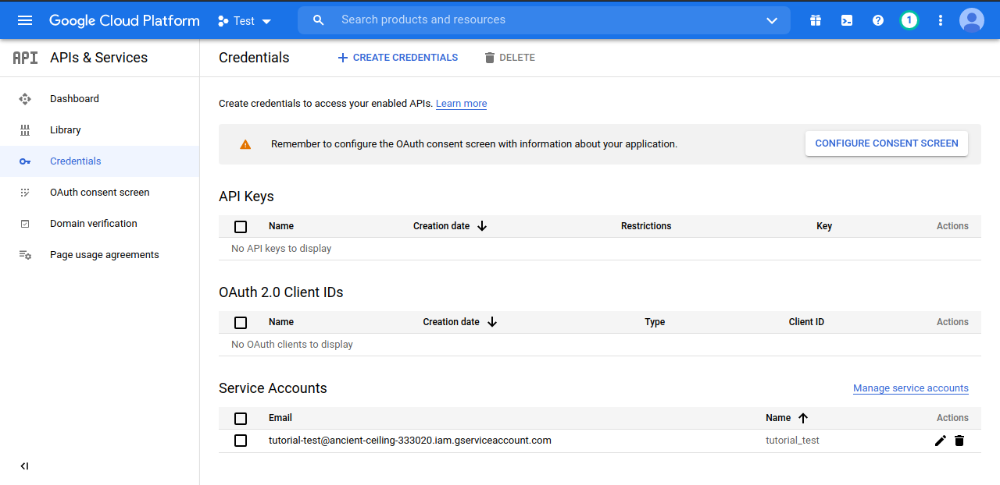

<!-- TODO: add tutorial on how to share a sheet with the service account -->
# Google API Setup

- Create a Google API project from [cloud console](https://console.cloud.google.com/)
  - Click on select project, or create new project

- Enable Google Sheets API from the [API Menu](https://console.cloud.google.com/apis/dashboard)

- Create credentials for service accounts with the needed access from the
  [Sheets Overview
  page](https://console.cloud.google.com/apis/api/sheets.googleapis.com/overview)
  - click on `create credentials`

- Fill the information as shown here

- Select your service account name

- This information can be left blank

- Click on the newly created service account and navigate to the keys tab

- Click on `Add Key` and select `Create new key`

- Select JSON and click create, a json file will be downloaded in your
    `downloads` folder

