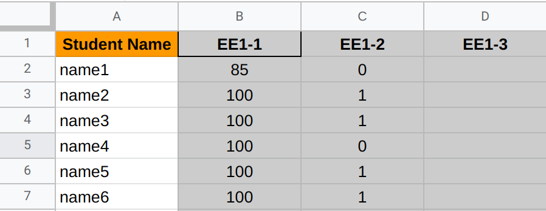
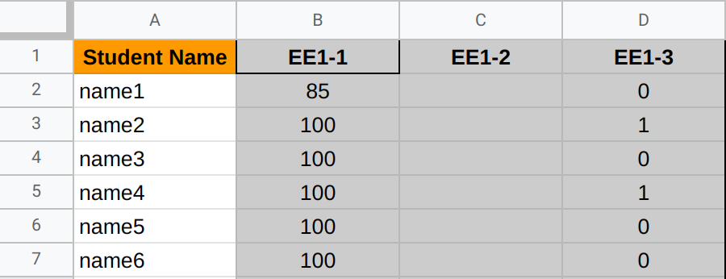

# Config Schemas

The examples shown here demonstrate the schemas for configuration read by
SheetShuttle. In order for the tool to function with no errors, user written
configuration must follow the specified format.

- [Config Schemas](#config-schemas)
  - [Sheets Schema](#sheets-schema)
    - [Defining Objects](#defining-objects)
      - [Region Object](#region-object)
        - [`contains_headers` Explained](#contains_headers-explained)
        - [`fill` Explained](#fill-explained)
        - [`types` Explained](#types-explained)
        - [Examples](#examples)
      - [Sheet Object](#sheet-object)
    - [Overall Structure](#overall-structure)
  - [GitHub Interactions Schema](#github-interactions-schema)
    - [Issue Schema](#issue-schema)
    - [Pull Request Schema](#pull-request-schema)
    - [File Schema](#file-schema)

## Sheets Schema

Sheets schema describe the format for configuration used to
retrieve Google Sheet data.

### Defining Objects

There are two main nested object structures used in the Sheets schema.

#### Region Object

This is the simplest object that does not contain complex nested objects in it. It
has the following general structure:

```yml
name: <string, required> name of the region to create
start: <string, required> cell to start from (eg. A1)
end: <string, required> cell to end at (eg. H12)
contains_headers: <boolean, required> if selected range contains
                  headers in the first row
headers: <list of strings, conditional> headers to be used, only
         required if contains_headers is false
fill: <boolean, optional> fill the region with `None` if there are missing values.
      Defaults to false
types: <string or object, optional> data type to use for the whole region or
       for specific columns. Defaults to `string`
```

Some values in this structure are a bit ambiguous, the following section will
provide further explanation on their usage:

##### `contains_headers` Explained

In many cases, the region being retrieved already contains the headers to the
data. Set this option to `true` in order to set the column headers of the
resulting Pandas dataframe equal to the first row of the data.

In the case that the data does not contain headers, another value `headers` is
required by the schema. It should be a list of strings with the headers of the
data.

**NOTE:** The length of the headers list must match the number of columns in the
data. Otherwise a Pandas error will be thrown.

##### `fill` Explained

SheetShuttle attempts to deal with missing data, but many limitations exist. The
following screenshot shows a dataset with empty cells. Let's see how
SheetShuttle allows you to deal with it.



When retrieved from the Google Sheets API, the data looks as follows:

```python
[
    ['Student Name', 'EE1-1', 'EE1-2', 'EE1-3'],
    ['name1', '85', '0'],
    ['name2', '100', '1'],
    ['name3', '100', '1'],
    ['name4', '100', '0'],
    ['name5', '100', '1'],
    ['name6', '100', '1']
]
```

As seen in the sample output, the missing data simply does not show up in the
returned value from the API. By enabling `fill`, the data is converted to the
following and then a dataframe is created using it.

```python
[
    ['Student Name', 'EE1-1', 'EE1-2', 'EE1-3'],
    ['name1', '85', '0', None],
    ['name2', '100', '1', None],
    ['name3', '100', '1', None],
    ['name4', '100', '0', None],
    ['name5', '100', '1', None],
    ['name6', '100', '1', None]
]
```

The same applies to empty rows, where a row full of `None` is appended in some cases.

Example:

```python
[
    ['Student Name', 'EE1-1', 'EE1-2', 'EE1-3'],
    ['name1', '85', '0', None],
    ['name2', '100', '1', None],
    ['name3', '100', '1', None],
    ['name4', '100', '0', None],
    ['name5', '100', '1', None],
    ['name6', '100', '1', None],
    [None, None, None, None]
]
```

`None` will then get converted to Not a Number `NaN` values in the resulting
Pandas dataframe.

**A problem with this approach is the following:**

Using a similar example where the missing data is not in the last row/column as
seen here:



The resulting data from the API is the following:

```python
[
    ['Student Name', 'EE1-1', 'EE1-2', 'EE1-3'],
    ['name1', '85', '', '0'],
    ['name2', '100', '', '1'],
    ['name3', '100', '', '0'],
    ['name4', '100', '', '1'],
    ['name5', '100', '', '0'],
    ['name6', '100', '', '0']
]
```

In this case, the `''` will not be replace by `None` and will stay the same even
when `fill` is enabled.

**IMPORTANT NOTE:** If working with numerical data with possibly some missing
fields, you MUST use the `float` type. This is because `int` cannot be converted
to `NaN` by Pandas while `float` can.

##### `types` Explained

By default, all data retrieved from Google Sheets is string. However, in the
case that a user would like to work with a variety of data types, they can use
this option to set the data type of the pandas dataframe.

The available data types are:

- `object`
- `string`
- `int`
- `float`
- `bool`
- `datetime`

`types` can be set to any of the items on that list. Additionally, the user can
determine data types for individual columns by doing the following:

```yaml
types:
    col1: int
    col2: string
    col3: bool
```

Where the keys are the names of the columns in the data and the value is the
data type of that specific column.

**Note:** using a name of a column that does not exist will throw an error

##### Examples

With the possible structures in mind, here are a couple of examples of how a
region object can look like:

**Example 1:**

```yml
name: grades
start: A1
end: L4
contains_headers: true
```

**Example 2:**

```yml
name: expenses
start: F5
end: K12
contains_headers: false
headers:
    - Jan
    - Feb
    - Mar
    - Apr
    - May
    - Jun
fill: true
```

```yml
name: expenses
start: A1
end: D6
contains_headers: true
types:
    day: string
    date: datetime
    expense: float
    paid: bool
```

#### Sheet Object

The sheet object is one level above the region structure and it looks as follow:

```yml
name: <string, required> name of sheet to read from in Google Sheets
regions: <list of region object, required> Regions to create from the sheet
```

**Example:**

```yml
name: sheet1
regions:
    - name: grades
      start: A1
      end: L4
      contains_headers: true
    - name: expenses
      start: F5
      end: K12
      contains_headers: false
      headers:
          - Jan
          - Feb
          - Mar
          - Apr
          - May
          - Jun
```

### Overall Structure

The outermost keys of the configuration must contain only two keys as follows:

```yml
source_id: <string, required> ID of sheet to read
sheets: <list of sheet objects, required>
```

**Example:**

```yml
source_id: my_sheet_id
sheets:
    - name: sheet1
      regions:
      - name: grades
        start: A1
        end: L4
        contains_headers: true
      - name: expenses
        start: F5
        end: K12
        contains_headers: false
        headers:
            - Jan
            - Feb
            - Mar
            - Apr
            - May
            - Jun
    - name: sheet2
      regions:
      - name: some_data
        start: A1
        end: Z10
        contains_headers: true
```

**JSON Schema Structure:**

This is the structure used to validate the configuration using `jsonschema`:

```json
{
    "type": "object",
    "properties": {
        "source_id": {"type": "string"},
        "sheets": {
            "type": "array",
            "items": {"$ref": "#/$defs/sheet"},
            "minItems": 1,
        },
    },
    "required": ["source_id", "sheets"],
    "$defs": {
        "region": {
            "type": "object",
            "properties": {
                "name": {"type": "string"},
                "start": {"type": "string"},
                "end": {"type": "string"},
                "contains_headers": {"type": "boolean"},
                "headers": {
                    "type": "array",
                    "items": {"type": "string"},
                    "minItems": 1,
                },
                "fill": {"type": "boolean"},
                "types": {
                    "anyOf": [
                        {
                            "type": "string",
                            "enum": [
                                "object",
                                "string",
                                "int",
                                "float",
                                "bool",
                                "datetime",
                            ],
                        },
                        {
                            "type": "object",
                            "additionalProperties": {
                                "type": "string",
                                "enum": [
                                    "object",
                                    "string",
                                    "int",
                                    "float",
                                    "bool",
                                    "datetime",
                                ],
                            },
                        },
                    ]
                },
            },
            "required": ["name", "start", "end", "contains_headers"],
            "if": {"properties": {"contains_headers": {"const": false}}},
            "then": {
                "required": ["headers"],
            },
        },
        "sheet": {
            "type": "object",
            "properties": {
                "name": {"type": "string"},
                "regions": {
                    "type": "array",
                    "items": {"$ref": "#/$defs/region"},
                    "minItems": 1,
                },
            },
            "required": ["name", "regions"],
        },
    },
}
```

## GitHub Interactions Schema

This type of schema describes the structure of configurations used to post
entries to Github such as issues, pull requests, and files.

### Issue Schema

Issue schemas follow a simple one-level structure.
The following example shows the structure:

```yml
type: <str, required> type of Entry, must equal "issue" (case sensitive)
action: <str, required> action to be executed
    ("create" -> create a new issue, OR "update" -> add a comment to existing issue)
repo: <str, required> name of repo to create the issue in. Formatted as <org>/<repo_name>
body: <str, required> body of the issue or comment
labels: <List[str], optional> list of labels to add to the issue
# Conditional properties
title: <str, conditional> title of the new issue, required if action is "new"
number: <int, conditional> number of the existing issue,
        required if action is "update"
```

Here are some examples of configuration to create and update issues on GitHub:

**Example 1:** Create a new issue

```yml
type: issue
action: create
repo: example_org/example_user
title: some new issue
body: example body
labels:
  - SheetShuttle
  - Automated
```

**Example 2:** Update issue #12 with a new comment and labels

```yml
type: issue
action: update
repo: example_org/example_user
number: 12
body: example body
labels:
  - SheetShuttle
  - Automated
```

**JSON Schema Structure:**

```json
{
        "type": "object",
        "properties": {
            "type": {"type": "string", "const": "issue"},
            "action": {"type": "string", "enum": ["create", "update"]},
            "repo": {"type": "string", "pattern": r"^.+[^\s]\/[^\s].+$"},
            "body": {"type": "string", "minLength": 1},
        },
        "required": ["type", "action", "repo", "body"],
        "if": {"properties": {"action": {"const": "create"}}},
        "then": {
            "properties": {
                "title": {"type": "string", "minLength": 1},
                "labels": {
                    "type": "array",
                    "items": {"type": "string", "minLength": 1},
                    "minItems": 1,
                },
            },
            "required": ["title"],
        },
        "else": {
            "properties": {
                "number": {"type": "integer"},
                "labels": {
                    "type": "array",
                    "items": {"type": "string", "minLength": 1},
                    "minItems": 1,
                },
            },
            "required": ["number"],
        },
    }
```

### Pull Request Schema

This schema structure is responsible for creating pull requests and updating
them with comments. It's very similar to the Issue schema with few exceptions.

```yml
type: <str, required> type of Entry, must equal "pull request" (case sensitive)
action: <str, required> action to be executed
        ("create" -> create a new PR, OR "update" -> add a comment to existing PR)
repo: <str, required> name of repo to create the issue in. Formatted as <org>/<repo_name>
body: <str, required> body of the pull request or comment
# Conditional properties if action is "create"
title: <str, conditional> title of the new issue, required if action is "new"
base: <str,conditional> name of the branch to merge into, required if action is "new"
head: <str,conditional> name of the branch to merge from, required if action is "new"
# Conditional properties if action is "update"
number: <int, conditional> number of the existing pull request,
        required if action is "update"
```

Here are some examples of configuration to create and update issues on GitHub:

**Example 1:** Create a new pull request

```yml
type: pull request
action: create
repo: example_org/example_user
title: some new pull request
body: example body
base: main
head: my_branch
```

**Example 2:** Update pull request #5 with a new comment

```yml
type: pull request
action: update
repo: example_org/example_user
number: 12
body: example body
```

**JSON Schema Structure:**

```json
{
        "type": "object",
        "properties": {
            "type": {"type": "string", "const": "pull request"},
            "action": {"type": "string", "enum": ["create", "update"]},
            "repo": {"type": "string", "pattern": r"^.+[^\s]\/[^\s].+$"},
            "body": {"type": "string", "minLength": 1},
        },
        "required": ["type", "action", "repo", "body"],
        "if": {"properties": {"action": {"const": "create"}}},
        "then": {
            "properties": {
                "title": {"type": "string", "minLength": 1},
                "base": {"type": "string", "minLength": 1},
                "head": {"type": "string", "minLength": 1},
            },
            "required": ["title", "base", "head"],
        },
        "else": {
            "properties": {
                "number": {"type": "integer"},
            },
            "required": ["number"],
        },
    }
```

### File Schema

This schema structure is responsible for creating files and updating
them as well as replacing them entirely. Unlike the issue and pull request
schemas, this one supports 3 actions `create`, `update`, and `replace`.
While `update` preserves the ordinal content of the file, `replace` erases the
old content.

```yml
type: <str, required> type of Entry, must equal "file" (case sensitive)
action: <str, required> action to be executed
        ("create" OR "update" OR "replace")
repo: <str, required> name of repo to create the issue in. Formatted as <org>/<repo_name>
path: <str, required> path to the file to be impacted
content: <str, required> content of the file
branch: <str, required> name of the branch that the file exists in
commit_message: <str, optional> the commit message to used when executing the action
```

Here are some examples of configuration to create, update, and replace files:

**Example 1:** Create a new markdown file

```yml
type: file
action: create
repo: example_org/example_user
path: folder/file.md
content: "# Hello world!"
branch: main
commit_message: add example markdown file
```

**Example 2:** Update an existing markdown file

```yml
type: file
action: update
repo: example_org/example_user
path: folder/file.md
content: this is an example
branch: main
commit_message: update example markdown file
```

**Example 3:** Replace an existing markdown file

```yml
type: file
action: replace
repo: example_org/example_user
path: folder/file.md
content: "# Section 1"
branch: main
commit_message: replace example markdown file
```

**JSON Schema Structure:**

```json
{
        "type": "object",
        "properties": {
            "type": {"type": "string", "const": "file"},
            "action": {"type": "string", "enum": ["create", "update", "replace"]},
            "repo": {"type": "string", "pattern": r"^.+[^\s]\/[^\s].+$"},
            "path": {"type": "string", "minLength": 1},
            "content": {"type": "string", "minLength": 1},
            "branch": {"type": "string", "minLength": 1},
            "commit_message": {"type": "string", "minLength": 1},
        },
        "required": ["type", "action", "repo", "path", "content", "branch"],
    }
```
